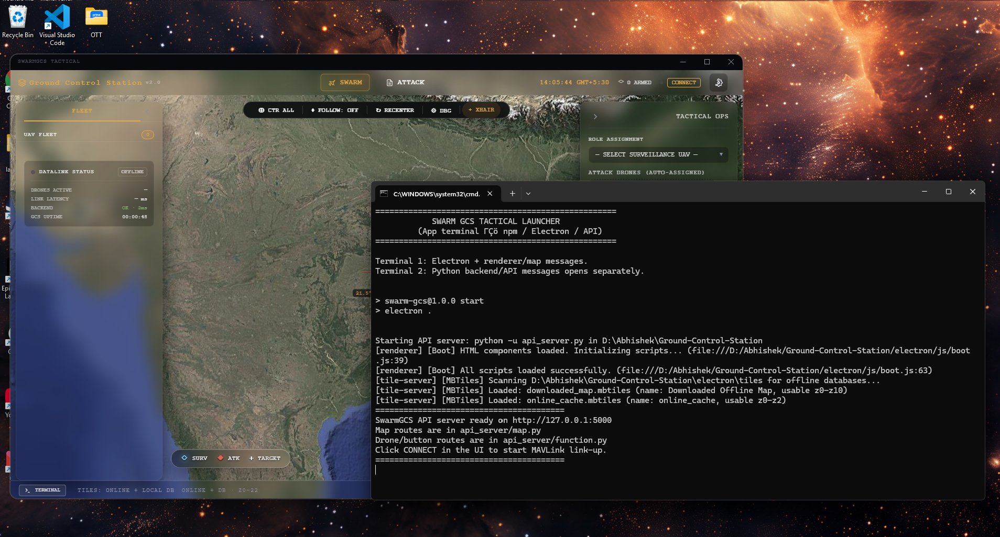
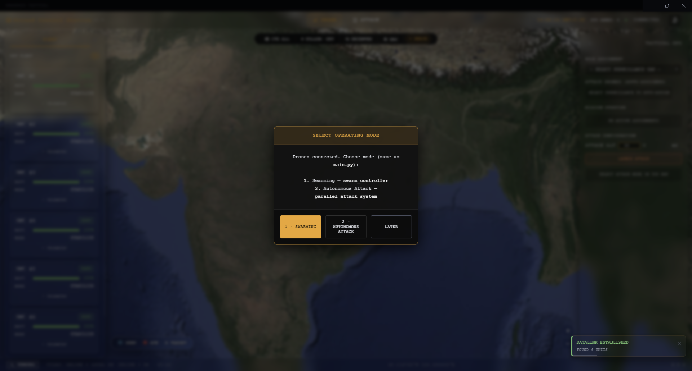
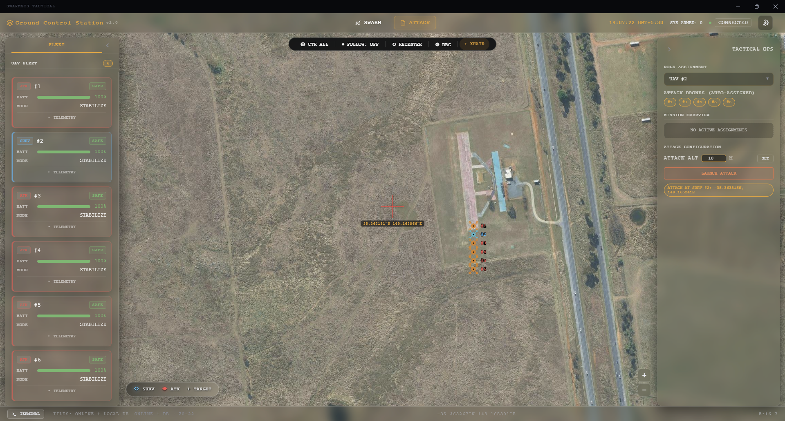
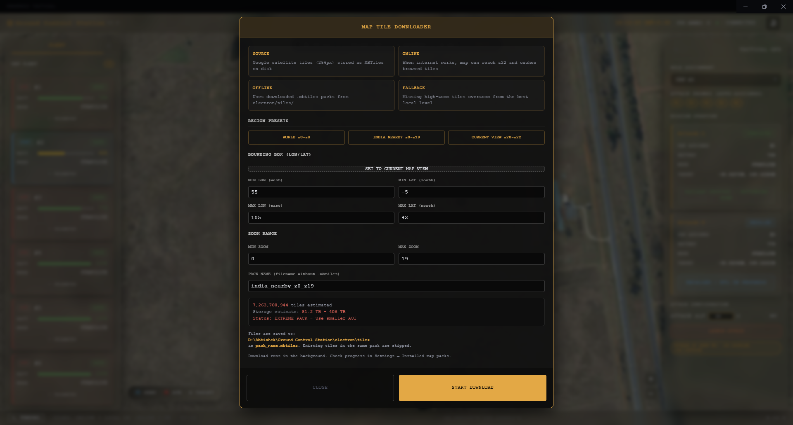
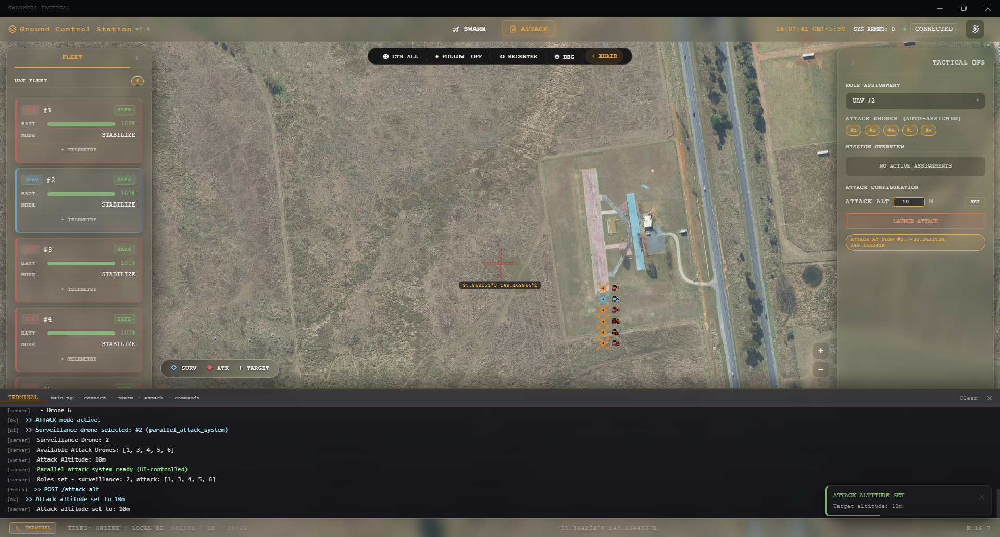
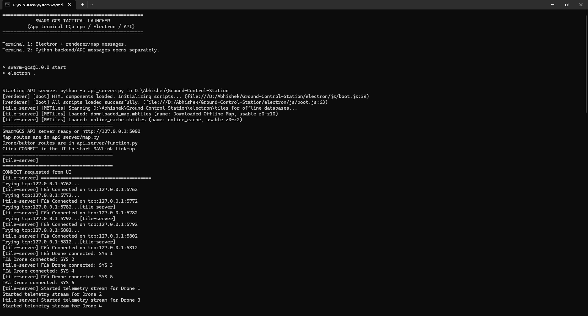

# SwarmGCS Tactical

SwarmGCS Tactical is a full-stack drone swarm Ground Control Station designed for real-time monitoring, command, and coordination of multiple UAVs using MAVLink. It combines an Electron-based desktop UI with a modular Python API, offering mission planning, live telemetry visualization, swarm operation modes, and offline mapping support — all in one self-contained application.

The UI features a clean, glass-panel aesthetic with a modular layout, giving each control surface — map, telemetry, mission controls — its own distinct, translucent panel rather than a single cluttered dashboard. An in-app terminal is built directly into the interface, surfacing live backend logs, connection status, and command output without needing to switch to an external console.

The system is built around two main layers: a Python backend that handles drone connections, telemetry, and command execution over MAVLink, and an Electron frontend that renders the map, telemetry, and mission controls in real time. The two communicate over a local HTTP API, keeping the UI responsive even while managing multiple simultaneous drone connections.

---

## Demo

A full walkthrough of the app — from startup to mission execution.

https://github.com/user-attachments/assets/6738505c-18e7-4756-9029-d38db88d45d8

---

## Screenshots

### 1. Getting Started

The startup flow: launching the app, selecting a mission type, configuring the UAV for surveillance, and confirming the system is ready to fly.

| | |
|---|---|
|  **App Startup**<br>Initial launch screen as the Electron UI comes up and the backend API begins connecting. |  **Mission Type Selection**<br>Choosing the operating mode — surveillance, swarm, or attack — before mission configuration begins. |
|  **Surveillance UAV Setup**<br>Configuring drone roles and parameters for a surveillance mission before launch. |  **System Ready**<br>Confirmation screen once all drones are connected, configured, and cleared for mission start. |

### 2. Mission Execution

The core mission loop: launching the swarm, executing the attack sequence, releasing payload, and returning to base.

| | |
|---|---|
|  **Swarm Launched — Attack Initiated**<br>Surveillance drone airborne and attack sequence triggered from the GCS. |   **Attack Drone En Route**<br>Attack drone navigating autonomously to the designated target location. |
|  **Payload Dropped**<br>Payload release confirmed at the target location, logged in real time by the GCS. |  **Returning to Base**<br>Drone executing RTL (Return-to-Launch) after mission completion. |

### 3. Mapping & Configuration

Offline map management and system-wide settings.

| | |
|---|---|
|  **Offline Map Downloader**<br>Downloading and caching map tiles locally for offline mission planning in low-connectivity environments. |  **Overall Settings**<br>Global configuration panel for connection parameters, mission defaults, and app preferences. |

### 4. System Monitoring

Live diagnostics surfaced directly in the UI, without needing an external console.

| | |
|---|---|
|  **In-App Terminal**<br>Live backend logs, MAVLink connection status, and command output streamed directly into the UI. |  **Detailed Logs View**<br>Expanded log output for debugging connection issues and reviewing command history. |

---

## Project Structure

The backend is organized as a modular Python API under the `api_server/` package, with drone connection, telemetry, and swarm-control logic separated into their own dedicated modules for clarity and maintainability.

## Start

On a new Windows system, run the dependency installer first:

```bat
requirements\install_windows.bat
```

It installs Python packages, downloads portable Node.js when Node is missing, runs `npm install`, and creates:

```bat
Run_SwarmGCS_Portable.bat
```

Run the launcher batch script:

```bat
Launch_SwarmGCS.bat
```

Two terminals will be used automatically:
1. **Launcher terminal:** Electron startup plus important renderer/app messages.
2. **Python backend terminal:** `api_server.py` output, MAVLink connection logs, command logs, and tile-server logs.

The UI opens immediately and uses online tiles while the local API starts. When `http://127.0.0.1:5000/health` is ready, it switches to the local API/cache flow automatically.

## Backend Structure

The real API is split by responsibility under the `api_server/` package:

| File | Purpose |
| --- | --- |
| `api_server.py` | Thin launcher script. Imports and runs the API server. |
| `api_server/server.py` | Creates Flask app, registers routes, and starts Waitress WSGI. |
| `api_server/shared.py` | Shared state: drone managers, mission state, heartbeat, terminal logs. |
| `api_server/map.py` | Map metadata, tile serving, online cache, MBTiles packs, offline downloads. |
| `api_server/function.py` | Connect, mode, roles, attack, target, command, and telemetry routes. |
| `api_server/terminal.py`| UI terminal management (clear, health). |

## Why Not Run `main.py` Directly?

`main.py` is a terminal-operated CLI flow. It creates its own `DroneManager` and `StateManager`, then waits for `input()` to select the operating mode. If the Electron app launched `main.py` directly, the UI would not be able to read that internal state through HTTP, and the API would block on terminal input.

Instead, the API reuses the exact same underlying core modules used by `main.py`:
- `gcs_core_logic.Mavlink.tcp_connection.auto_connect_tcp`
- `gcs_core_logic.Mavlink.Telemetry.TelemetryListener`
- `gcs_core_logic.drone.DroneManager`
- `gcs_core_logic.drone.StateManager`
- `gcs_core_logic.Mavlink.Command`
- `gcs_core_logic.core_logic.parallel_attack_system._deploy_drone_thread`

*Note: `main.py`, `core_logic/`, `Mavlink/`, and `drone/` have intentionally been left untouched to preserve the original CLI capabilities.*

## UI To Backend Wiring

| UI action | Endpoint | Module |
| --- | --- | --- |
| Backend health | `GET /health` | `api_server/function.py` |
| CONNECT | `POST /connect` | `api_server/function.py` |
| Live telemetry | `GET /state` | `api_server/function.py` |
| Mission state | `GET /mission` | `api_server/function.py` |
| SWARM / ATTACK mode | `POST /mode` | `api_server/function.py` |
| Surveillance dropdown | `POST /roles` | `api_server/function.py` |
| Launch attack | `POST /attack` | `api_server/function.py` |
| Attack altitude | `POST /attack_alt` | `api_server/function.py` |
| RTL / DROP / ARM / TAKEOFF / LAND | `POST /command` | `api_server/function.py` |
| Map metadata | `GET /tiles/metadata` | `api_server/map.py` |
| Map tile | `GET /tiles/{z}/{x}/{y}` | `api_server/map.py` |
| Offline map download | `POST /download_map` | `api_server/map.py` |
| Map packs list/delete/rename | `/tiles/packs` | `api_server/map.py` |

## Map Behavior

- Online tiles are requested directly through the local API.
- Successfully loaded online tiles are actively cached into `electron/tiles/online_cache.mbtiles`.
- Offline packs live in `electron/tiles/*.mbtiles`.
- Missing local high-zoom tiles overzoom from the best available parent tile instead of leaving hard blue gaps.

## Development

Backend only:
```bash
python -u api_server.py
```

Frontend only:
```bash
cd electron
npm start
```

The frontend expects the backend to be running at `http://127.0.0.1:5000`.
